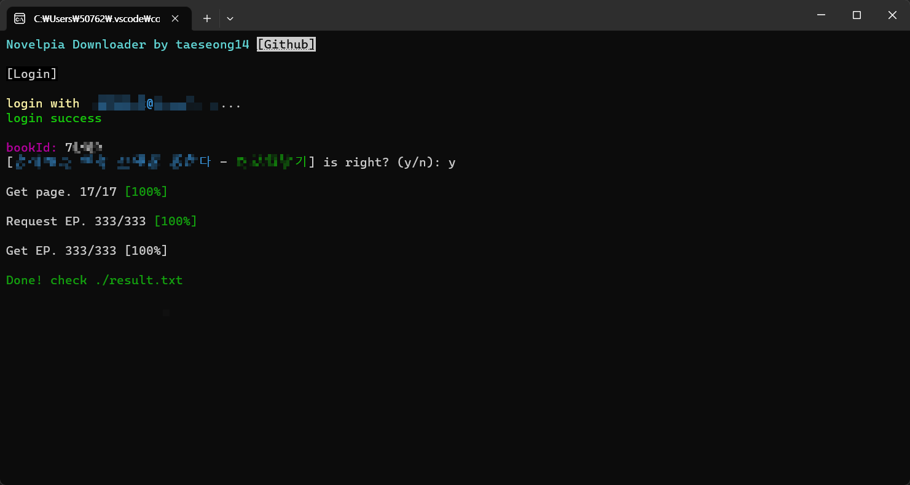

# [Novelpia Downloader](https://github.com/taeseong14/N-down)

속보) 구조 바꾸기 귀찮다

노벨피아 다운로더

> 개발노트

 - 설정 추가예정(계정, 삽화 url 유무, 화수(1화, 2화) 유무 등등)

> 사용법

 * 1. 릴리즈([v0.0.7](https://github.com/taeseong14/N-down/releases/tag/v0.0.7))에서 "downloader.zip" 을 받는다
 * 2. 압축을 푼다
 * 3. id(노벨피아 only, 구글 등 연동 ㄴㄴ) 와 password 입력
 * 4. bookId(소설번호: 178143 등)
 * 5. 끝날때까지 기다린다

끝!
result/[소설명].txt 에서 확인하십숑

예제:

자세한건 설명서(zip파일의 README) ㄱㄱ

.exe라서 머시기하면 직접 빌드해서 돌리생요

---

If there's any problem while downloading, progressing, or any additional function you want

[click here to make new issue](https://github.com/taeseong14/N-down/issues/new)

+ 기존꺼와 다른 문제/개선점이라면 새 이슈를 추가해주세요. (^)

 + 개발자 컨택: hutao@genshin.ai
