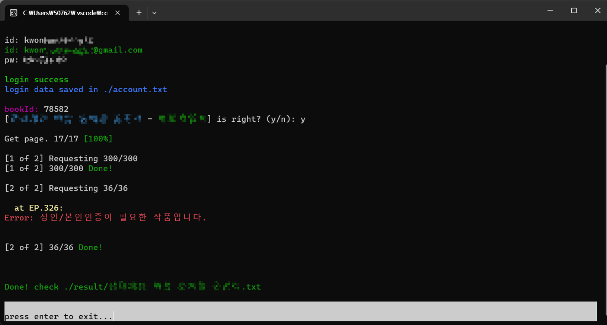

# [Novelpia Downloader](https://github.com/taeseong14/N-down)

노벨피아 다운로더

> 개발노트

 - 설정 파일 추가예정(계정, 삽화 url 유무, 화수(1화, 2화) 유무 등등)

> 사용법

 * 1. 릴리즈([v0.1.1](https://github.com/taeseong14/N-down/releases/tag/v0.1.1))에서 "downloader.zip" 을 받는다
 * 2. 압축을 푼다
 * 3. downloader.exe 실행
 * 4. id(노벨피아 only, 구글 등 연동 ㄴㄴ) 와 password 입력
 * 5. bookId 입력(소설번호: 178143 등)

끝!
result/[소설명].txt 파일에서 확인하십숑

예제:

참고) Windows PowerShell을 이용해야 빤딱빤딱하게 나오빈다.

자세한건 설명서(zip파일의 README) ㄱㄱ

---

### 주의사항

 - exe 파일 다운로드 시, 실행 시에 경고창이 뜨지만 [위 downloader.go 파일](./downloader.go)을 빌드한것이니까 안심하셔도 됩니다. (정 머하면 golang 설치후 직접 go build downloader.go 쳐서 exe 만들기)
 - 동시에 여러개를 다운받으면 사용자에게 피해가 갈 수 있습니다.
 - 이 프로그램을 사용함으로써 생기는 피해는 이 프로그램의 제작자가 책임지지 않으며, 이 프로그램의 결과물의 저작권은 모두 원 저작자에게 있습니다. 무단 배포 및 전재가 금지됩니다.
 - 실행시 exe파일이 있는 폴더에 result폴더와 account.txt파일, settings.txt 파일을 생성하니 주의해주세요.

---

If there's any problem while downloading, progressing, or any additional function you want

[click here to make new issue](https://github.com/taeseong14/N-down/issues/new)

 + 기존꺼와 다른 문제/개선점이라면 새 이슈를 추가해주세요. (^)

 + 개발자 컨택: hutao@genshin.ai
